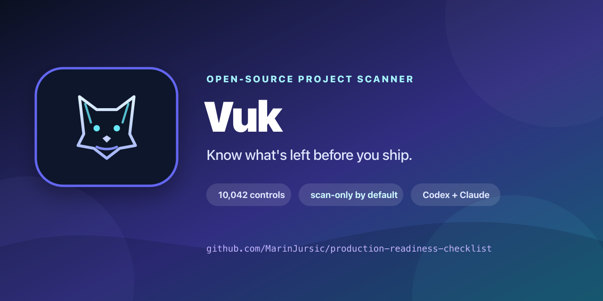

<div align="center">



# Production Readiness Checklist

**10,042 evidence-driven controls for engineering and shipping software with confidence.**

[](docs/engineering/00-overview.md)
[](https://github.com/MarinJursic/production-readiness-checklist/actions/workflows/validate.yml)
[](https://marinjursic.github.io/production-readiness-checklist/)
[](https://github.com/MarinJursic/production-readiness-checklist)
[](LICENSE)

[Begin the complete review](docs/engineering/00-overview.md) · [Check a release quickly](docs/guides/getting-started.md) · [Use with an AI agent](docs/guides/ai-assisted-review.md) · [Contribute](CONTRIBUTING.md)

⭐ [Star this project](https://github.com/MarinJursic/production-readiness-checklist) · 🤝 [Help improve it](CONTRIBUTING.md) · [Share on LinkedIn](https://www.linkedin.com/sharing/share-offsite/?url=https%3A%2F%2Fmarinjursic.github.io%2Fproduction-readiness-checklist%2F) · [Share on X](https://twitter.com/intent/tweet?text=Production%20Readiness%20Checklist%3A%2010%2C042%20evidence-driven%20software%20engineering%20and%20release%20controls.&url=https%3A%2F%2Fmarinjursic.github.io%2Fproduction-readiness-checklist%2F)

</div>

---

Production readiness is not “all tests are green.” It is an evidence-backed decision about the exact product and artifact you intend to operate.

This repository provides one start-to-finish review path:

1. **Engineering lifecycle:** 8,621 unique `USEQ-*` controls across 16 phases, from governance and requirements through implementation, delivery, operations, AI, and specialized domains.
2. **Production decision:** 1,421 `PRC-*` controls across ten release tracks, ending with evidence, sign-off, deployment, and verification.

The source material contained 25,359 checkbox lines across 215 documents. It was consolidated into 16 navigable lifecycle manuals, with exact duplicates, repeated boilerplate, mirrored production controls, and 1,969 repeated cross-volume occurrences in the final corpus removed. The [source consolidation manifest](docs/engineering/source-manifest.md) records the treatment of every source document and section.

> [!IMPORTANT]
> No checklist or AI review can prove that a nontrivial application has zero defects. A credible decision requires current evidence, explicit risk ownership, and tested recovery paths. One material failure can block approval regardless of how many unrelated controls pass.

## Start here

For a product-wide assessment, begin with the [complete engineering review](docs/engineering/00-overview.md) and follow phases 1–16 in order. Then complete the production-release tracks.

For an imminent release with an established engineering baseline:

1. Copy the [release assessment template](docs/records/release-assessment.md).
2. Run the [immediate no-go screen](docs/checklists/01-release-foundations.md#2-immediate-no-go-conditions).
3. Review affected lifecycle controls and every applicable production track.
4. Record Pass, Fail, Blocked, or Not Applicable against each stable control ID.
5. Complete the [evidence and decision track](docs/checklists/10-evidence-and-decision.md).

## Complete engineering review

| Phases | Coverage |
| --- | --- |
| [1. Governance](docs/engineering/01-governance-and-foundations.md) · [2. Product](docs/engineering/02-product-and-requirements.md) · [3. UX](docs/engineering/03-user-experience-web-and-content.md) · [4. Architecture](docs/engineering/04-architecture-and-design.md) | Scope, ownership, risk, requirements, user experience, and system design |
| [5. Code](docs/engineering/05-code-quality-and-implementation.md) · [6. Services and APIs](docs/engineering/06-application-services-and-apis.md) · [7. Data](docs/engineering/07-data-and-information-lifecycle.md) · [8. Security](docs/engineering/08-security-and-cryptography.md) · [9. Privacy](docs/engineering/09-privacy-and-data-protection.md) · [10. Testing](docs/engineering/10-verification-and-testing.md) | Product construction and verification |
| [11. Platform and delivery](docs/engineering/11-developer-experience-platform-and-delivery.md) · [12. Operations and SRE](docs/engineering/12-operations-sre-and-support.md) · [13. Documentation](docs/engineering/13-documentation-and-knowledge.md) | Build, deploy, observe, recover, support, and maintain |
| [14. Trust and safety](docs/engineering/14-trust-safety-and-ecosystems.md) · [15. AI and ML](docs/engineering/15-ai-ml-and-ai-assisted-development.md) · [16. Specialized domains](docs/engineering/16-specialized-domains-and-release-assurance.md) | Triggered and emerging product risks, connected to final release assurance |

The order is for dependable navigation, not a waterfall mandate. Iterative teams can revisit phases continuously, but every applicable control still needs a disposition before final approval.

## Final production review

The ten production tracks cover release identity and no-go conditions; product risk and architecture; source, build, and supply chain; environments, quality, and experience; application security; data, privacy, and performance; reliability and operations; maintenance, vendors, and compliance; conditional features; and the final evidence-backed decision.

[Start the production review](docs/checklists/01-release-foundations.md) or read the [readiness principle](docs/checklists/00-readiness-principle.md).

## Use it with Claude or another coding agent

The root [`CLAUDE.md`](CLAUDE.md) and copy-ready prompts teach an agent to distinguish verified evidence from assumptions, cite repository evidence, and leave production-only or organizational questions Blocked.

```text
Perform a read-only, full-lifecycle review using CLAUDE.md.
Review docs/engineering phases 1–16, then docs/checklists for the final release gate.
Cite evidence for every Pass and list every unknown separately.
Do not modify code and do not make the final release decision.
```

- [Full repository review prompt](docs/prompts/full-readiness-review.md)
- [Release-diff review prompt](docs/prompts/release-diff-review.md)
- [Evidence challenge prompt](docs/prompts/evidence-challenge.md)
- [AI-assisted review guide](docs/guides/ai-assisted-review.md)

## Experimental scanner: evidence-driven and bounded

The repository now includes an experimental deterministic scanner vertical slice. It inventories a declared repository without executing target code, creates a versioned assessment plan, evaluates the 30-assertion `prc/core-repository@0.3` profile, stores content-addressed evidence, and preserves unknown and manual results. Native checks cover repository governance, source identity and integrity, dependency inputs and runtime declarations, GitHub Actions safety, container build definitions, Terraform locks, and Kubernetes workload policy. A strict OCI adapter protocol can feed live observations into an exact profile binding while leaving assessment authority with the engine; the production profile intentionally authorizes no external image until one is published and reviewed. A bounded loop composes independently verified R1 candidates for missing source-file final newlines and broadly writable file modes, enforces cumulative budgets, and reports all remaining work; it never changes the original workspace or merges, deploys, or releases a candidate. Experimental Codex and Claude Code provider adapters produce read-only, schema-constrained proposals. A separate scanner-owned R2 path can parse one validated proposal into an isolated candidate and accept it only when deterministic path, budget, target-assertion, regression, and source-integrity checks pass.

The scanner is designed to:

- map findings to stable `USEQ-*` and `PRC-*` control IDs;
- cite the exact code, configuration, documentation, test, or operational evidence behind every result;
- distinguish verified facts from assumptions and unavailable production or organizational evidence;
- generate a full, prioritized list of gaps, required manual checks, and recommended next actions;
- export scoped JSON, Markdown, HTML, SARIF, and JUnit results without collapsing them into a readiness score;
- support different languages, frameworks, platforms, and deployment models without locking the project to one technology vendor; and
- keep risk acceptance and the final release decision with accountable humans.

The scanner will not claim that a project has zero defects or make an unqualified production-readiness decision. It may report that a versioned profile is satisfied for a specific target and evidence set. Coding agents will be replaceable, constrained patch generators; deterministic checks and policy will own truth and patch acceptance.

Start with the [scanner quick start](docs/scanner/getting-started.md), [scanner diagnostics](docs/scanner/doctor.md), [declared project configuration](docs/scanner/configuration.md), [durable state and history](docs/scanner/state-and-history.md), [diff-aware evidence invalidation](docs/scanner/diff-and-invalidation.md), [isolated remediation guide](docs/scanner/remediation.md), and [read-only agent provider guide](docs/architecture/agent-providers.md), then read the [product contract](docs/architecture/product-contract.md), [trust model](docs/architecture/trust-model.md), [adapter protocol](docs/architecture/adapters.md), [bounded applicability model](docs/architecture/applicability.md), [evidence model](docs/architecture/evidence-and-results.md), and [bounded remediation contract](docs/architecture/remediation-contract.md). The CLI remains experimental and intentionally reports unsupported analysis as blocked rather than treating it as a pass.

## Evidence, not checkbox theater

| Field | Example |
| --- | --- |
| Control | `USEQ-1A2B3C4D` or `PRC-34-017` |
| Status | Pass / Fail / Blocked / Not Applicable |
| Owner | One accountable person |
| Evidence | Test run, configuration export, dashboard, decision record, or drill report |
| Scope | Product, commit, artifact, configuration, data, and environment |
| Reviewed | Reviewer, date, freshness, and limitations |
| Exception | Risk owner, compensating control, remediation date, and expiry |

Use the [evidence record](docs/records/evidence-record.md) and [risk exception](docs/records/risk-exception.md) templates to keep reviews auditable.

## Repository structure

```text
.
├── CLAUDE.md                  # Guardrails for AI-assisted reviews
├── catalog/                   # Versioned objectives, assertions, and profiles
├── cmd/prc/                   # Experimental scanner CLI
├── docs/
│   ├── engineering/           # 16-phase lifecycle review + source manifest
│   ├── checklists/            # 10 final production tracks
│   ├── guides/                # Adoption and AI-review guidance
│   ├── prompts/               # Copy-ready agent prompts
│   ├── records/               # Evidence, risk, release, and decision templates
│   └── scanner/               # Scanner usage and generated profile documentation
├── fixtures/                  # Positive, negative, and adversarial scanner cases
├── scanner/                   # Inventory, evaluation, adapters, and bounded remediation
├── schemas/                   # Versioned catalog and scanner JSON schemas
├── scripts/                   # Generation, validation, and integrity tooling
└── .github/                   # Issue forms, PR template, and CI workflows
```

## Standards and scope

The structure was researched against whole-lifecycle and engineering-quality sources including ISO/IEC/IEEE 12207:2026, SWEBOK Guide V4.0, ISO/IEC 25010:2023, NIST SSDF 1.1, OWASP ASVS, WCAG 2.2, NIST AI RMF, and DORA guidance. See [references and scope](docs/references.md) for primary links and limitations.

This project is engineering guidance, not legal advice, a certification, or a substitute for qualified security, privacy, accessibility, safety, or compliance review.

## Contributing

This project should improve through real-world experience. If a control is missing, duplicated, unclear, outdated, incorrectly categorized, or difficult to verify, please help fix it. Contributions can expand the checklist, improve existing wording and evidence guidance, strengthen the documentation and tooling, or advance the future AI scanner.

- [Propose a missing or improved control](https://github.com/MarinJursic/production-readiness-checklist/issues/new?template=control-proposal.yml)
- [Report a documentation or navigation problem](https://github.com/MarinJursic/production-readiness-checklist/issues/new?template=documentation.yml)
- Read the [contribution guide](CONTRIBUTING.md) and open a focused pull request

First-time contributors are welcome. Please report vulnerabilities privately as described in [SECURITY.md](SECURITY.md).

If this project helps your team, [star the repository](https://github.com/MarinJursic/production-readiness-checklist), share the [documentation site](https://marinjursic.github.io/production-readiness-checklist/), or use GitHub’s **Cite this repository** action via [CITATION.cff](CITATION.cff).

Released under the [MIT License](LICENSE).
