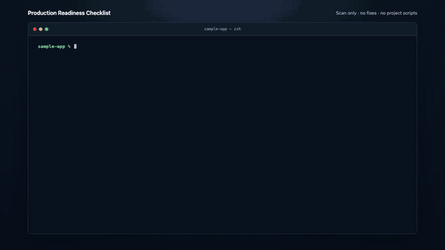

<div align="center">


# Production Readiness Checklist

**Know what's ready and what still needs work.**

10,042 evidence-driven controls plus a read-only scanner for understanding what a project has proved, what failed, and what still needs review.

[](docs/engineering/00-overview.md)
[](https://github.com/MarinJursic/production-readiness-checklist/actions/workflows/validate.yml)
[](https://marinjursic.github.io/production-readiness-checklist/)
[](https://github.com/MarinJursic/production-readiness-checklist)
[](LICENSE)

[Begin the complete review](docs/engineering/00-overview.md) · [Check a release quickly](docs/guides/getting-started.md) · [Use with an AI agent](docs/guides/ai-assisted-review.md) · [Contribute](CONTRIBUTING.md)

**[See the reviewed classification and exact checking route for every one of the 10,042 controls](docs/control-classification/README.md)**

⭐ [Star this project](https://github.com/MarinJursic/production-readiness-checklist) · 🤝 [Help improve it](CONTRIBUTING.md) · [Share on LinkedIn](https://www.linkedin.com/sharing/share-offsite/?url=https%3A%2F%2Fmarinjursic.github.io%2Fproduction-readiness-checklist%2F) · [Share on X](https://twitter.com/intent/tweet?text=Production%20Readiness%20Checklist%3A%20know%20what%27s%20ready%20and%20what%20still%20needs%20work.&url=https%3A%2F%2Fmarinjursic.github.io%2Fproduction-readiness-checklist%2F)

<a href="docs/assets/production-readiness-scan-demo.mp4"></a>

<sub>Install once, run <code>prc</code>, then open the report. Click the preview for the full 720p video.</sub>

</div>

---

Production readiness is not “all tests are green.” It is an evidence-backed decision about the exact product and artifact you intend to operate.

This repository provides one start-to-finish review path:

1. **Engineering lifecycle:** 8,621 unique `USEQ-*` controls across 16 phases, from governance and requirements through implementation, delivery, operations, AI, and specialized domains.
2. **Production decision:** 1,421 `PRC-*` controls across ten release tracks, ending with evidence, sign-off, deployment, and verification.

The source material contained 25,359 checkbox lines across 215 documents. It was consolidated into 16 navigable lifecycle manuals, with exact duplicates, repeated boilerplate, mirrored production controls, and 1,969 repeated cross-volume occurrences in the final corpus removed. The [source consolidation manifest](docs/engineering/source-manifest.md) records the treatment of every source document and section.

Every control has now received a rule-by-rule primary classification, an independent skeptical review of every proposed deterministic rule, and a third semantic-strength audit. The validated result is **10,042 reviewed classifications: 686 deterministic and 9,356 nondeterministic**. The deterministic set has **686 one-to-one control bindings containing 765 exact clauses**, with a versioned checker family, required evidence authority, executable predicate, and pass/fail/blocked/adversarial fixtures for every clause. Read the [full classification reference](docs/control-classification/README.md) to see each decision and its reason.

Those programs are fail-closed contracts, not a claim that 686 broad controls all run end to end today. The normal `prc` command runs the existing 40 local assertions plus the exact catalog programs whose evidence collectors are available. The first shipped collector can prove `PRC-36-004` when a root Node package declares usable build and test scripts and both public commands appear in bounded, inventoried Markdown code. It verifies the exact file hashes and returns Blocked for missing, changed, malformed, oversized, unsupported, or unclear evidence. The remaining authority-specific collectors are not shipped yet. A rule that needs an unavailable collector, external registry, environment access, complete scope, or other authoritative evidence remains **Blocked**; it is never counted as passed just because a predicate exists.

> [!IMPORTANT]
> No checklist or AI review can prove that a nontrivial application has zero defects. A credible decision requires current evidence, explicit risk ownership, and tested recovery paths. One material failure can block approval regardless of how many unrelated controls pass.

## Start here

For a product-wide assessment, begin with the [complete engineering review](docs/engineering/00-overview.md) and follow phases 1–16 in order. Then complete the production-release tracks.

For an imminent release with an established engineering baseline:

1. Copy the [release assessment template](docs/records/release-assessment.md).
2. Run the [immediate no-go screen](docs/checklists/01-release-foundations.md#2-immediate-no-go-conditions).
3. Review affected lifecycle controls and every applicable production track.
4. Record Pass, Fail, Blocked, or Not Applicable against each stable control ID.
5. Complete the [evidence and decision track](docs/checklists/10-evidence-and-decision.md).

## Complete engineering review

| Phases | Coverage |
| --- | --- |
| [1. Governance](docs/engineering/01-governance-and-foundations.md) · [2. Product](docs/engineering/02-product-and-requirements.md) · [3. UX](docs/engineering/03-user-experience-web-and-content.md) · [4. Architecture](docs/engineering/04-architecture-and-design.md) | Scope, ownership, risk, requirements, user experience, and system design |
| [5. Code](docs/engineering/05-code-quality-and-implementation.md) · [6. Services and APIs](docs/engineering/06-application-services-and-apis.md) · [7. Data](docs/engineering/07-data-and-information-lifecycle.md) · [8. Security](docs/engineering/08-security-and-cryptography.md) · [9. Privacy](docs/engineering/09-privacy-and-data-protection.md) · [10. Testing](docs/engineering/10-verification-and-testing.md) | Product construction and verification |
| [11. Platform and delivery](docs/engineering/11-developer-experience-platform-and-delivery.md) · [12. Operations and SRE](docs/engineering/12-operations-sre-and-support.md) · [13. Documentation](docs/engineering/13-documentation-and-knowledge.md) | Build, deploy, observe, recover, support, and maintain |
| [14. Trust and safety](docs/engineering/14-trust-safety-and-ecosystems.md) · [15. AI and ML](docs/engineering/15-ai-ml-and-ai-assisted-development.md) · [16. Specialized domains](docs/engineering/16-specialized-domains-and-release-assurance.md) | Triggered and emerging product risks, connected to final release assurance |

The order is for dependable navigation, not a waterfall mandate. Iterative teams can revisit phases continuously, but every applicable control still needs a disposition before final approval.

## Final production review

The ten production tracks cover release identity and no-go conditions; product risk and architecture; source, build, and supply chain; environments, quality, and experience; application security; data, privacy, and performance; reliability and operations; maintenance, vendors, and compliance; conditional features; and the final evidence-backed decision.

[Start the production review](docs/checklists/01-release-foundations.md) or read the [readiness principle](docs/checklists/00-readiness-principle.md).

## Use it with Claude or another coding agent

The root [`CLAUDE.md`](CLAUDE.md) and copy-ready prompts teach an agent to distinguish verified evidence from assumptions, cite repository evidence, and leave production-only or organizational questions Blocked.

```text
Perform a read-only, full-lifecycle review using CLAUDE.md.
Review docs/engineering phases 1–16, then docs/checklists for the final release gate.
Cite evidence for every Pass and list every unknown separately.
Do not modify code and do not make the final release decision.
```

- [Full repository review prompt](docs/prompts/full-readiness-review.md)
- [Release-diff review prompt](docs/prompts/release-diff-review.md)
- [Evidence challenge prompt](docs/prompts/evidence-challenge.md)
- [AI-assisted review guide](docs/guides/ai-assisted-review.md)

## Scanner: install, run, read the report

Install the latest [`@marinjursic/prc`](https://www.npmjs.com/package/@marinjursic/prc) once. Then open a project and run one command:

```bash
npm install -g @marinjursic/prc@latest
cd /path/to/project
prc
```

That is the normal 40-check local scan. To scan a different folder without changing directories, run `prc /path/to/project`. Use `prc --help` only when you need the other commands or options. There is no `npx` prefix.

The npm command installs one user-facing package. Like other native CLIs, it keeps the small `prc` launcher separate from the OS-specific binary so npm downloads only the binary for this computer. Update or remove the global tool with:

```bash
npm install -g @marinjursic/prc@latest
npm uninstall -g @marinjursic/prc
```

Run `prc version` at any time to see the installed version. Installing, updating, removing, or running the global command does not add files to the project being scanned.

The scan is read-only: it does **not** fix files, run project code, install project dependencies, or write the report into the project. It checks exact local facts, prints a clear score and Pass/Fail/Review summary, and creates a private HTML report in your user cache. Every report includes all **10,042 controls**; broad rules that cannot be proved from source stay visibly in review instead of being counted as passed.

### What happens when you run `prc`

1. It reads the selected project without following symlinks or running project commands.
2. It runs 40 narrow checks for facts it can prove from the files, such as a license, dependency lock files, test setup, CI safety, exposed private keys, API files, containers, Terraform, and Kubernetes settings.
3. It runs supported exact catalog programs over sealed evidence, retains validated evidence documents for replay, then connects every result to the full 10,042-control catalog. A small check never pretends it proved a much larger rule.
4. It shows the overall result, score, passed count, failed count, and items that still need a person or more evidence.
5. It prints the exact HTML report path. In supported terminals, that path is clickable. The report starts simple and keeps long evidence, IDs, and the full catalog inside expandable details.

The global install lives in npm's tool directory, outside every project you scan. It does not add project `node_modules`, edit `package.json`, or change a lock file. The package has no install scripts and no third-party JavaScript dependencies, does not download a fallback binary, and does not update itself in the background. npm selects one native package for the current operating system; the small launcher verifies that binary and every bundled runtime file before starting it without a shell.

Every new npm release declares its security-related dual-use features, is built with no long-lived npm token, pauses for the maintainer's npm 2FA approval, and stays as a draft GitHub release until all seven public packages match the sealed release bytes and expose npm provenance. The [release verification guide](docs/scanner/releases.md) explains the complete chain. These checks protect package origin and integrity; they do not replace reviewing what a scanner is allowed to read or run.

The package keeps the complete control data but excludes the website, video, contributor-only files, and internal classification-review packets. Its large control indexes are stored in a bounded compressed form and are expanded only in memory, so this does not remove rules or weaken checks. Release builds also strip unused debug data and enforce compressed and installed-size limits.

If npm reports a global-install permission error, install Node with a version manager instead of using `sudo`. For an extra-strict installation that disables package lifecycle scripts, the longer equivalent is `npm install -g --ignore-scripts @marinjursic/prc`.

The scanner prints the exact project path before inventory begins. If an inventory limit stops the scan, first check that path: run the command inside the project root or pass it directly, for example `prc /path/to/project`. Clear generated caches when appropriate, but do not raise the 8 GiB safety guard or delete real project data just to force a scan through.

Only use a project-local install when a team or CI job specifically needs the scanner recorded in that project's lock file:

```bash
npm install -D -E --ignore-scripts --no-audit --no-fund @marinjursic/prc@0.1.9
npm exec --offline --no -- prc scan
```

The install places reviewed package files in `node_modules` and updates `package.json` and `package-lock.json`; review those changes before committing them. The offline run fails instead of downloading a missing package.

For a short command that the whole project can reuse, add this to `package.json`:

```json
{
  "scripts": {
    "scan": "prc"
  }
}
```

Run it with `npm run scan`. npm reserves its top-level command names, so a project cannot add a custom `npm scan` command. Use `npm run --ignore-scripts scan` when you also want npm to skip `prescan` and `postscan` hooks.

### One-time setup from source

You need Git and Go 1.27 or a compatible later supported toolchain.

```bash
git clone https://github.com/MarinJursic/production-readiness-checklist.git
cd production-readiness-checklist
go mod verify
go build -trimpath -o prc ./cmd/prc
./prc doctor
```

The `prc` binary is now ready. `doctor` checks that the target and bundled catalog
can be read and explains any missing optional tool; it does not run the target.
Keep the binary in this directory, because the scanner automatically finds the compatible bundled `catalog/` beside it. Published scanner release archives already contain the binary, catalog, adapter manifests, schemas, and scanner guides together; verify a downloaded archive as described in the [release guide](docs/scanner/releases.md), extract it, and run from anywhere without installing project dependencies.

To use `prc` without the `./` prefix, add this entire directory to `PATH`; do not move only the binary away from its compatible catalog. On macOS or Linux, for example: `export PATH="/absolute/path/to/production-readiness-checklist:$PATH"`.

### Choose a scan level

Choose one of three clear levels:

```bash
# Normal local scan: 40 checks, no AI.
prc

# Fast local screen: 18 high-signal checks, no AI.
prc quick

# Full catalog AI advice, after provider login.
prc full codex
# or: prc full claude
```

Every level still lists all 10,042 controls in the report. `quick` means fewer
local checks and less terminal noise; it does not mean the other controls
passed. `full` runs the core local scan and asks the selected AI provider for
advice on all 9,356 reviewed nondeterministic controls. The 686 deterministic
controls never go to AI for a verdict. Supported exact programs can now produce
a verified result; the rest remain Blocked until complete authoritative evidence
and a reviewed collector exist. AI advice remains unverified.

### Where AI is used

AI is **off by default**. You do not need Codex or Claude Code to install the scanner, run `prc` or `prc quick`, check local files, calculate the score, or create the HTML report.

| Command | Uses AI? | What it does |
| --- | --- | --- |
| `prc quick` | No | Runs 18 small local checks and writes the report. |
| `prc` | No | Runs the normal 40 local checks and writes the report. |
| `prc full codex` | Yes, Codex | Runs the same 40 local checks, then reviews all 9,356 nondeterministic controls in quality-first deep mode. |
| `prc full claude` | Yes, Claude Code | Runs the same deep advisory review with Claude Code instead. |
| `prc fix ...` | Optional | A separate, advanced path can ask a chosen AI for a small patch idea inside an isolated copy. A scan never starts this path. |

AI is advisory only for nondeterministic or contextual review whose answer depends on the project. For example, a script should not force every project to use folders named `src`, `components`, and `tests`. An AI review can look at the screened file list and short source excerpts, explain whether the layout is hard to follow for this project, and suggest a better fit. That answer is advice, not proof, so it cannot create a verified Pass, verified Fail, or final Not Applicable result.

When running a source build that is not on `PATH`, use the same commands with the `./` prefix:

```bash
./prc
```

The command accepts options before or after the project path. The terminal shows every deterministic result with a word and symbol. On a real terminal, Pass is green and Fail is red; redirected and machine output has no color:

```text
  ╭────────────────────────────────────────────────────╮
  │  ✓  PRODUCTION READINESS CHECKLIST                 │
  │     Know what's ready and what still needs work.   │
  ╰────────────────────────────────────────────────────╯

Production Readiness Checklist 0.1.9

Run: 91c2…
Profile: prc/core-repository@1.0
Target: example-api (4c0e…)
Mode: scan only — no fixes and no project scripts

Checking 40 deterministic assertions...

  ✓ PASS     PRC-A-CORE-001  Observed README.md.
  ✗ FAIL     PRC-A-CORE-007  No supported lock file was found for node.
  ! BLOCKED  PRC-A-CORE-013  The optional analysis was not authorized.
  ? MANUAL   PRC-A-CORE-012  An accountable reviewer must supply evidence.

  ╭─ SCAN COMPLETE
  │ Needs work
  │ ██████████████████░░ 93% · 37/40 applicable checks passed
  │ 1 failed · 1 unresolved · 1 manual · 0 not applicable
  ╰─ One or more required local checks failed.

Needs attention
  ✗ FAIL     HIGH     PRC-A-CORE-007  No supported lock file was found for node.
  ! BLOCKED  MEDIUM   PRC-A-CORE-013  The optional analysis was not authorized.
  ? MANUAL   LOW      PRC-A-CORE-012  An accountable reviewer must supply evidence.

Coverage
  Local checks     40 total · 37 passed · 3 need attention · 0 did not apply
  Full catalog     10042/10042 included · 10020 need evidence or review

Report
  Detailed report: /Users/you/Library/Caches/prc/reports/example-api-91c2….html
  Click the report path to open remediation steps, evidence, category scores, and all controls.
  Scan mode: report only; no fixes were applied. No project scripts were run.
```

Click the reported path in a supported terminal to open the HTML file in your browser; in other terminals, copy or open the same plain path normally. The first screen shows the project, one large score, the readiness result, and four counts: passed, failed, review, and not needed. Smaller category scores come next, followed by verified problems sorted from critical to informational. Each problem begins as a compact, severity-colored row; open it to see the full reason and suggested next action. Scoring notes, passed checks, raw evidence, long file lists, IDs, scan metadata, and the complete 10,042-control catalog stay behind clearly labeled detail controls until you need them. `needs_review` means the scanner has not proved the broad rule. `partially_verified` means linked narrow checks passed; it is still not a complete Pass. Reports are private and stored outside the scanned project by default, so creating one does not change the project being scanned. The cache keeps the five newest default reports and removes older scanner-generated reports; a path supplied with `--report` is never pruned.

The report separates verified problems, narrow checks that passed, unresolved
local checks, manual decisions, broad controls still needing evidence, and AI
advice. An AI citation can be marked `snapshot_location_validated` only when it
points to a real line in the exact screened snapshot. Its claim is still marked
`advisory_unverified`: a real line can be irrelevant or misunderstood.

A result-bearing exit code is not a crash: `0` means the selected profile passed, `1` means an active gate failed, and `2` means evidence remains incomplete or blocked. Use `--exit-policy never` only when a script should always receive `0` after a completed report; the report still preserves the real terminal state.

Useful report options:

```bash
# Choose a new output path; an existing file is never overwritten.
./prc scan /path/to/project --report /safe/path/readiness.html

# Print JSON for another tool. Machine formats do not create an extra HTML file.
./prc scan /path/to/project --format json --exit-policy never > readiness.json

# Explicitly suppress the default HTML report.
./prc scan /path/to/project --no-report
```

The native `prc scan` command remains available for Go, Python, Java, Rust, infrastructure, air-gapped, and mixed repositories that do not use npm.

### Optional deep review with Codex or Claude Code

The ordinary scan is local and deterministic. AI review is a separate option for broad or subjective rules such as project-appropriate folder structure. First sign in through an installed provider CLI, then scan:

```bash
prc login codex
prc full codex
```

For Claude Code, use:

```bash
prc login claude
prc full claude
```

`prc auth` shows login status and `prc logout codex` or `prc logout claude` clears the scanner's saved login. These commands use each provider's official sign-in flow. The scanner stores that login in a private scanner-only directory, separate from the provider's normal configuration, plugins, instructions, and sessions. Existing supported API-key environment variables remain an alternative.

`prc full` uses the same guarded path as `prc scan --ai`. Selecting the provider is also your explicit permission to send bounded, secret-screened source excerpts to that remote provider. The provider receives no target workspace path and gets no shell, file-reading, write, web, MCP, or install tools. Do not enable AI review for source that its provider is not allowed to process.

The full run is intentionally large: all 9,356 nondeterministic controls are
sent in sealed batches of at most eight. The coordinator must create one
separate primary subagent per rule. Deep mode also creates one independent
skeptical subagent per batch and reconciles its counterexamples with the
primary reviews. The short `prc full` command uses four parallel provider
workers; Codex also uses `xhigh` reasoning. Each result contains a priority,
risk, ordered fix steps, independent verification steps, evidence still needed,
and the strongest skeptical challenge. These remain advice, never verified
findings.

Completed batches are saved outside the target and reused when the same scan
resumes. If a later batch fails, the scanner writes a clearly marked partial
report containing every completed, schema-checked result before it returns the
execution error. Run the same command again to reuse those batches and
continue. The terminal shows the plan, bounded progress, elapsed time, cached
work, and new Codex token totals or Claude cost estimates when the provider
reports them. This can take a long time and use many tokens. AI results cannot
create a verified Pass, verified Fail, or final Not Applicable decision, and
they cannot modify the project.

Advanced options such as reviewing one control, changing effort, or setting a Claude cost limit remain available in the [safe AI control review](docs/scanner/ai-control-review.md).

### What it checks today

The default profile checks repository governance, immutable source identity, dependency and runtime declarations, discoverable tests, GitHub Actions safety, private-key armor, OpenAPI contracts, Go HTTP timeout hazards, container definitions, Terraform locks, and Kubernetes workload policy. Focused API, Kubernetes, supply-chain, and infrastructure-as-code profiles are also available. Reviewed offline OCI adapters exist for Gitleaks, Syft, Grype, and Checkov, but external analyzers are never launched by the simple command; they require an explicit `verify-local` capability grant, an exact profile binding, and pinned local inputs. The [infrastructure policy guide](docs/scanner/infrastructure-policy.md) includes the exact Checkov command and its limits.

The scanner includes every production concern in its report, but it does not pretend every concern can be proved from source code. Unsupported runtime, organizational, environment, legal, and human evidence stays visibly blocked or in review. That is intentional: the report describes what was actually proven for one target and evidence set, not an unqualified claim that software has no defects.

Fixing is a separate workflow. `prc scan` never calls it. The bounded `prc fix` command works only in isolated candidate directories and supports a deliberately small set of independently verifiable changes; it never merges, deploys, or releases anything automatically.

Continue with the [complete scanner quick start](docs/scanner/getting-started.md), [safe start-to-finish walkthrough](docs/scanner/security-walkthrough.md), [CLI and exit codes](docs/scanner/cli-contract.md), [diagnostics](docs/scanner/doctor.md), [read-only agent integration](docs/scanner/mcp-agent-integration.md), [project configuration](docs/scanner/configuration.md), [state and history](docs/scanner/state-and-history.md), [supply-chain scanning](docs/scanner/supply-chain.md), and [isolated remediation](docs/scanner/remediation.md). The [evidence-backed production convergence roadmap](docs/architecture/evidence-backed-production-convergence.md) records the quality target, measured current state, implementation order, and acceptance gates. The [research findings and improvement plan](research/PROJECT_RESEARCH_AND_IMPROVEMENT_PLAN.md) records the Reddit audit, standards review, coverage gaps, and prioritized next work. Architecture details live in the [product contract](docs/architecture/product-contract.md), [trust model](docs/architecture/trust-model.md), [adapter protocol](docs/architecture/adapters.md), [evidence model](docs/architecture/evidence-and-results.md), and [remediation contract](docs/architecture/remediation-contract.md).

### What is still being built

- More narrow, tested local checks. The catalog currently has 43 executable assertions linked to 26 broad controls; the normal profile runs 40 and the quick profile runs 18. Most broad controls still need evidence or review.
- More authority-specific read-only collectors for the reviewed deterministic catalog. Classification, bindings, exact predicates, the runtime, report aggregation, and the first repository collector now run end to end, but most of the 765 clauses still need a trusted source adapter. Missing collectors, external providers, complete scope, or authoritative evidence must stay Blocked.
- Deeper meaning checks beyond the new readable, non-whitespace text baseline for repository documents—for example, whether a security policy gives useful reporting steps—without forcing one language, file name, heading, or folder layout.
- Domain-level synthesis and root-cause deduplication above the rule-by-rule AI reviews, so related advice becomes one dependency-ordered improvement plan instead of repeated symptoms.
- Larger real-project accuracy tests for Codex and Claude review, including cost, partial resume, false-positive, missed-finding, prompt-injection, disagreement, and unusual-project-layout measurements.
- Independent checks of the meaning of AI advice. The scanner can prove that an AI-cited file and line existed in the screened snapshot, but it cannot yet prove that the sentence the AI wrote about that line is correct.
- Safer native installation choices for people without Node, such as signed standalone installers or package-manager formulas. These should download a fixed, verified scanner release—not hide the npm command inside a mutable shell script.
- Broader isolated fixes with independent tests. Scan will remain report-only, and no fix path will silently merge, deploy, or claim that every production concern was solved.

## Evidence, not checkbox theater

| Field | Example |
| --- | --- |
| Control | `USEQ-1A2B3C4D` or `PRC-34-017` |
| Status | Pass / Fail / Blocked / Not Applicable |
| Owner | One accountable person |
| Evidence | Test run, configuration export, dashboard, decision record, or drill report |
| Scope | Product, commit, artifact, configuration, data, and environment |
| Reviewed | Reviewer, date, freshness, and limitations |
| Exception | Risk owner, compensating control, remediation date, and expiry |

Use the [evidence record](docs/records/evidence-record.md) and [risk exception](docs/records/risk-exception.md) templates to keep reviews auditable.

## Repository structure

```text
.
├── adapters/                 # Reviewed, immutable external-analyzer manifests
├── CLAUDE.md                  # Guardrails for AI-assisted reviews
├── catalog/                   # Versioned objectives, assertions, and profiles
├── cmd/prc/                   # Scanner CLI
├── docs/
│   ├── engineering/           # 16-phase lifecycle review + source manifest
│   ├── checklists/            # 10 final production tracks
│   ├── guides/                # Adoption and AI-review guidance
│   ├── prompts/               # Copy-ready agent prompts
│   ├── records/               # Evidence, risk, release, and decision templates
│   └── scanner/               # Scanner usage and generated profile documentation
├── fixtures/                  # Positive, negative, and adversarial scanner cases
├── scanner/                   # Inventory, evaluation, adapters, and bounded remediation
├── schemas/                   # Versioned catalog and scanner JSON schemas
├── scripts/                   # Generation, validation, and integrity tooling
└── .github/                   # Issue forms, PR template, and CI workflows
```

## Standards and scope

The structure was researched against whole-lifecycle and engineering-quality sources including ISO/IEC/IEEE 12207:2026, SWEBOK Guide V4.0, ISO/IEC 25010:2023, NIST SSDF 1.1, OWASP ASVS, WCAG 2.2, NIST AI RMF, and DORA guidance. See [references and scope](docs/references.md) for primary links and limitations.

This project is engineering guidance, not legal advice, a certification, or a substitute for qualified security, privacy, accessibility, safety, or compliance review.

## Contributing

This project should improve through real-world experience. If a control is missing, duplicated, unclear, outdated, incorrectly categorized, or difficult to verify, please help fix it. Contributions can expand the checklist, improve existing wording and evidence guidance, strengthen the documentation and tooling, or advance the future AI scanner.

- [Propose a missing or improved control](https://github.com/MarinJursic/production-readiness-checklist/issues/new?template=control-proposal.yml)
- [Report a documentation or navigation problem](https://github.com/MarinJursic/production-readiness-checklist/issues/new?template=documentation.yml)
- Read the [contribution guide](CONTRIBUTING.md) and open a focused pull request

First-time contributors are welcome. Please report vulnerabilities privately as described in [SECURITY.md](SECURITY.md).

If this project helps your team, [star the repository](https://github.com/MarinJursic/production-readiness-checklist), share the [documentation site](https://marinjursic.github.io/production-readiness-checklist/), or use GitHub’s **Cite this repository** action via [CITATION.cff](CITATION.cff).

Released under the [MIT License](LICENSE).
